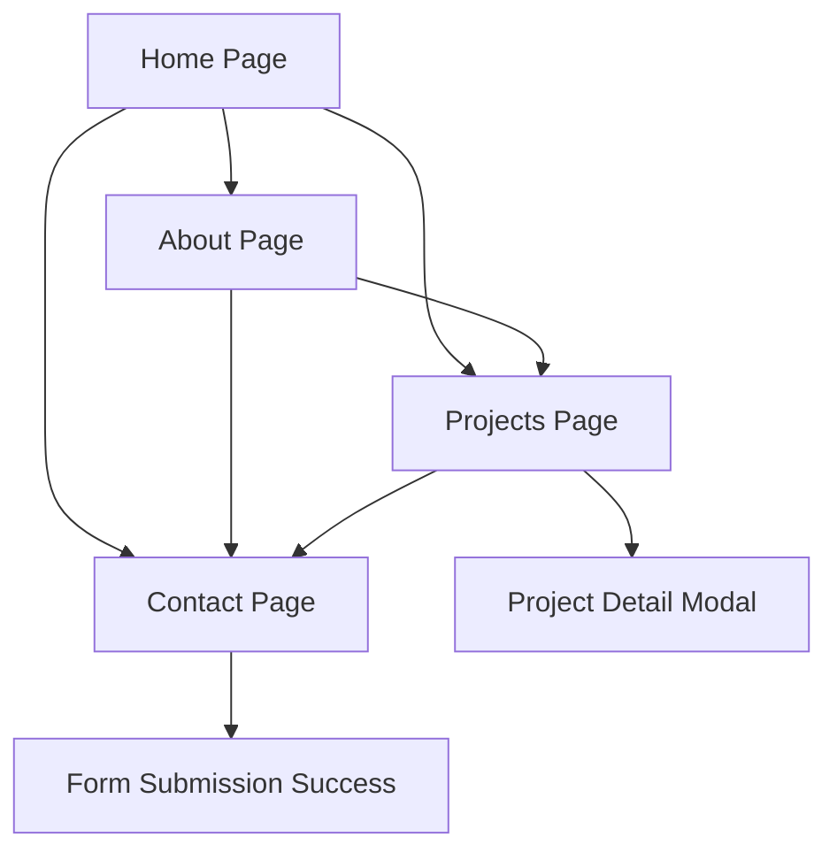

## 1. Product Overview
Website personal modern dengan tema hitam putih minimalis yang dibangun menggunakan Next.js. Website ini dirancang untuk menampilkan profil profesional, portofolio proyek, dan informasi kontak dengan desain yang elegan dan kontemporer.

Website ini membantu individu untuk membangun kehadiran online yang kuat dengan tampilan yang bersih dan modern, memudahkan pengunjung untuk mengetahui tentang Anda, melihat pekerjaan Anda, dan menghubungi Anda dengan mudah.

Target pasar: profesional kreatif, developer, desainer, dan siapa saja yang ingin membangun personal branding secara online.

## 2. Core Features

### 2.1 User Roles
Tidak diperlukan sistem registrasi untuk website personal ini. Website bersifat statis dan publik untuk semua pengunjung.

### 2.2 Feature Module
Website personal ini terdiri dari halaman-halaman berikut:
1. **Home page**: hero section, navigasi, informasi singkat tentang Anda.
2. **About page**: detail profil, pengalaman, keahlian, dan latar belakang.
3. **Projects page**: daftar proyek dengan deskripsi dan link.
4. **Contact page**: formulir kontak dan informasi kontak.

### 2.3 Page Details
| Page Name | Module Name | Feature description |
|-----------|-------------|---------------------|
| Home page | Hero section | Tampilkan nama lengkap, profesi, dan tagline yang menarik dengan animasi teks ketik. |
| Home page | Navigation | Menu navigasi minimalis yang tetap terlihat saat scroll, terdiri dari Home, About, Projects, Contact. |
| Home page | Social links | Ikon sosial media yang mengarah ke LinkedIn, GitHub, Twitter, Instagram dengan hover effect. |
| About page | Profile section | Foto profil, deskripsi singkat tentang diri, dan filosofi kerja. |
| About page | Experience timeline | Timeline vertikal menampilkan pengalaman kerja dan pendidikan dengan format tanggal. |
| About page | Skills showcase | Grid ikon teknologi dan keahlian dengan animasi on-scroll. |
| Projects page | Project grid | Daftar proyek dalam format kartu dengan gambar thumbnail, judul, deskripsi singkat, dan teknologi yang digunakan. |
| Projects page | Project filter | Filter berdasarkan kategori (Web, Mobile, Design, Other) dengan animasi smooth. |
| Projects page | Project modal | Modal detail proyek dengan gambar tambahan, deskripsi lengkap, link demo dan kode. |
| Contact page | Contact form | Formulir dengan field nama, email, subjek, pesan dengan validasi real-time. |
| Contact page | Contact info | Informasi email, telepon, lokasi dengan ikon yang sesuai. |
| Contact page | Success message | Pesan konfirmasi setelah form terkirim dengan animasi. |

## 3. Core Process
User mengunjungi website dan melihat hero section di homepage. User dapat menavigasi ke halaman About untuk mengetahui lebih lanjut tentang Anda, melihat proyek-proyek di halaman Projects, dan menghubungi melalui halaman Contact.

## 4. User Interface Design

### 4.1 Design Style
- **Warna utama**: Hitam (#000000) dan Putih (#FFFFFF) - tanpa warna lain
- **Warna aksen**: Abu-abu gelap (#1a1a1a) dan abu-abu terang (#f5f5f5)
- **Button style**: Rounded corners dengan hover effect yang smooth
- **Font**: Inter atau Poppins untuk heading, Roboto untuk body text
- **Font sizes**: Heading 48-64px, Subheading 24-32px, Body 16-18px
- **Layout style**: Grid-based dengan whitespace yang besar
- **Icon style**: Line icons dari Heroicons atau Feather Icons
- **Animasi**: Smooth scroll, fade-in on scroll, hover transitions

### 4.2 Page Design Overview
| Page Name | Module Name | UI Elements |
|-----------|-------------|-------------|
| Home page | Hero section | Text besar bergaya dengan animasi ketik, background putih/hitam bergantian, minimalis. |
| Home page | Navigation | Navbar transparan yang berubah solid saat scroll, menu horizontal dengan underline hover effect. |
| About page | Profile section | Layout dua kolom (foto dan teks), foto bulat dengan border tipis. |
| About page | Experience timeline | Garis vertikal dengan titik-titik untuk setiap pengalaman, kartu informasi muncul di samping. |
| Projects page | Project grid | Masonry grid 3 kolom di desktop, 1 kolom di mobile, kartu dengan shadow minimal. |
| Contact page | Contact form | Form dengan input fields yang elegan, tombol submit besar dengan hover effect. |

### 4.3 Responsiveness
- Desktop-first approach dengan breakpoint: Desktop (1200px+), Tablet (768px-1199px), Mobile (max 767px)
- Touch interaction optimization untuk mobile dengan button yang mudah di-tap
- Hamburger menu untuk navigasi di mobile dengan smooth animation
- Font sizes yang menyesuaikan ukuran layar

### 4.4 Performance Requirements
- Lighthouse score minimal 90 untuk performance
- Lazy loading untuk gambar proyek
- Preload untuk font dan critical CSS
- Image optimization dengan Next.js Image component
- Static generation untuk semua halaman