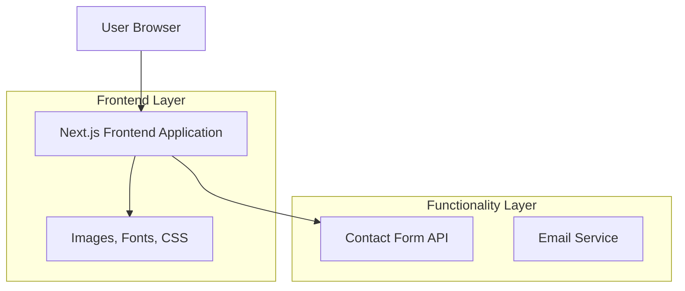

## 1. Architecture design



## 2. Technology Description
- **Frontend**: Next.js@14 + React@18 + TypeScript + Tailwind CSS
- **Initialization Tool**: create-next-app
- **Styling**: Tailwind CSS@3 dengan konfigurasi hitam-putih minimalis
- **Animation**: Framer Motion untuk animasi halus
- **Icons**: Heroicons atau Lucide React
- **Form Handling**: React Hook Form + Zod untuk validasi
- **Email Service**: EmailJS atau Nodemailer untuk form kontak
- **Image Optimization**: Next.js Image component
- **Performance**: Next.js Static Generation (SSG)

## 3. Route definitions
| Route | Purpose |
|-------|---------|
| / | Homepage dengan hero section dan navigasi |
| /about | Halaman profil dan pengalaman |
| /projects | Daftar portofolio proyek |
| /contact | Halaman kontak dengan formulir |
| /api/contact | API route untuk mengirim email dari form kontak |

## 4. Component Structure
```
src/
├── app/
│   ├── page.tsx (Homepage)
│   ├── about/page.tsx
│   ├── projects/page.tsx
│   ├── contact/page.tsx
│   ├── api/contact/route.ts
│   └── layout.tsx (Root layout)
├── components/
│   ├── ui/
│   │   ├── Button.tsx
│   │   ├── Card.tsx
│   │   ├── Input.tsx
│   │   └── Textarea.tsx
│   ├── layout/
│   │   ├── Navigation.tsx
│   │   ├── Footer.tsx
│   │   └── Container.tsx
│   ├── home/
│   │   ├── Hero.tsx
│   │   └── SocialLinks.tsx
│   ├── about/
│   │   ├── ProfileSection.tsx
│   │   ├── ExperienceTimeline.tsx
│   │   └── SkillsShowcase.tsx
│   ├── projects/
│   │   ├── ProjectGrid.tsx
│   │   ├── ProjectCard.tsx
│   │   └── ProjectModal.tsx
│   └── contact/
│       ├── ContactForm.tsx
│       └── ContactInfo.tsx
├── lib/
│   ├── utils.ts
│   └── validations.ts
├── hooks/
│   └── useScroll.ts
└── types/
    └── index.ts
```

## 5. API definitions

### 5.1 Contact Form API
```
POST /api/contact
```

Request:
| Param Name | Param Type | isRequired | Description |
|------------|-------------|-------------|-------------|
| name | string | true | Nama pengirim |
| email | string | true | Email pengirim |
| subject | string | true | Subjek pesan |
| message | string | true | Isi pesan |

Response:
| Param Name | Param Type | Description |
|------------|-------------|-------------|
| success | boolean | Status pengiriman email |
| message | string | Pesan konfirmasi atau error |

Example Request:
```json
{
  "name": "Budi Santoso",
  "email": "budi@email.com",
  "subject": "Tawaran Kerja",
  "message": "Saya tertarik dengan profile Anda dan ingin menawarkan kerja sama."
}
```

## 6. Data Structure

### 6.1 Project Data Structure
```typescript
interface Project {
  id: string;
  title: string;
  description: string;
  shortDescription: string;
  image: string;
  images: string[];
  technologies: string[];
  category: 'Web' | 'Mobile' | 'Design' | 'Other';
  demoUrl?: string;
  githubUrl?: string;
  featured: boolean;
  date: string;
}

interface Experience {
  id: string;
  title: string;
  company: string;
  location: string;
  startDate: string;
  endDate?: string;
  current: boolean;
  description: string[];
}

interface Skill {
  name: string;
  level: number; // 1-10
  category: 'Frontend' | 'Backend' | 'Design' | 'Tools';
}
```

### 6.2 Static Data Configuration
```typescript
// data/projects.ts
export const projects: Project[] = [
  {
    id: '1',
    title: 'E-commerce Platform',
    description: 'Platform e-commerce modern dengan Next.js dan Stripe integration',
    shortDescription: 'Modern e-commerce solution',
    image: '/images/projects/ecommerce.jpg',
    images: ['/images/projects/ecommerce-1.jpg', '/images/projects/ecommerce-2.jpg'],
    technologies: ['Next.js', 'TypeScript', 'Tailwind CSS', 'Stripe'],
    category: 'Web',
    demoUrl: 'https://demo.example.com',
    githubUrl: 'https://github.com/username/project',
    featured: true,
    date: '2024-01-15'
  },
  // ... more projects
];

// data/experience.ts
export const experiences: Experience[] = [
  {
    id: '1',
    title: 'Senior Frontend Developer',
    company: 'Tech Company',
    location: 'Jakarta, Indonesia',
    startDate: '2022-01-01',
    current: true,
    description: [
      'Mengembangkan aplikasi web modern dengan React dan Next.js',
      'Mentim junior developers dan melakukan code review'
    ]
  },
  // ... more experiences
];

// data/skills.ts
export const skills: Skill[] = [
  { name: 'React', level: 9, category: 'Frontend' },
  { name: 'Next.js', level: 8, category: 'Frontend' },
  { name: 'TypeScript', level: 8, category: 'Frontend' },
  // ... more skills
];
```

## 7. Performance Optimization
- **Static Generation**: Semua halaman menggunakan SSG untuk performa optimal
- **Image Optimization**: Menggunakan Next.js Image component dengan lazy loading
- **Font Optimization**: Menggunakan Next.js Font optimization untuk custom fonts
- **Bundle Optimization**: Code splitting otomatis dari Next.js
- **Caching**: Implementasi caching strategy untuk static assets
- **SEO**: Meta tags yang optimal untuk setiap halaman

## 8. Deployment Strategy
- **Platform**: Vercel (recommended untuk Next.js)
- **Environment Variables**: Konfigurasi untuk email service dan analytics
- **Domain**: Custom domain setup dengan SSL otomatis
- **Monitoring**: Vercel Analytics untuk performa monitoring